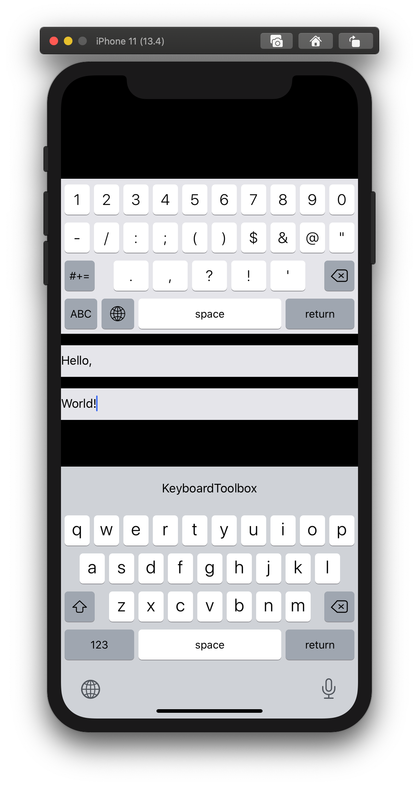

# KeyboardToolbox

<a href="https://swift.org/package-manager/"></a>
<a href="https://github.com/DimensionDev/KeyboardToolbox/blob/master/LICENSE"></a>

KeyboardToolbox is a swift package help you create iOS custom keyboard extension. The package contains a standard English keyboard implementation.

## Requirements

- iOS 13.0+
- Xcode 11.4+
- Swift 5.2+

## Usage

### Use as dependencies
The package could directly intergate into a Xcode iOS app. Please read the article:<br/>
[Adding Package Dependencies to Your App](https://developer.apple.com/documentation/xcode/adding_package_dependencies_to_your_app)

### Developing your keyboard package
You can use the `KeyboardCore` library in the package as dependecy to developing your Swift package. Add this dependency in your Package.swift.

```swift
    .package(url: "https://github.com/DimensionDev/KeyboardToolbox", from: "1.0.0"),
```
 
### Developing Local package
The package could resolved from local path. Please read the articles:<br/>

- [Developing a Swift Package in Tandem with an App](https://developer.apple.com/documentation/swift_packages/developing_a_swift_package_in_tandem_with_an_app)
- [Editing a Package Dependency as a Local Package](https://developer.apple.com/documentation/swift_packages/editing_a_package_dependency_as_a_local_package)

## Example
There is a demo app under `./Example`.



## License
KeyboardToolbox is released under the [AGPL](./LICENSE) License.

